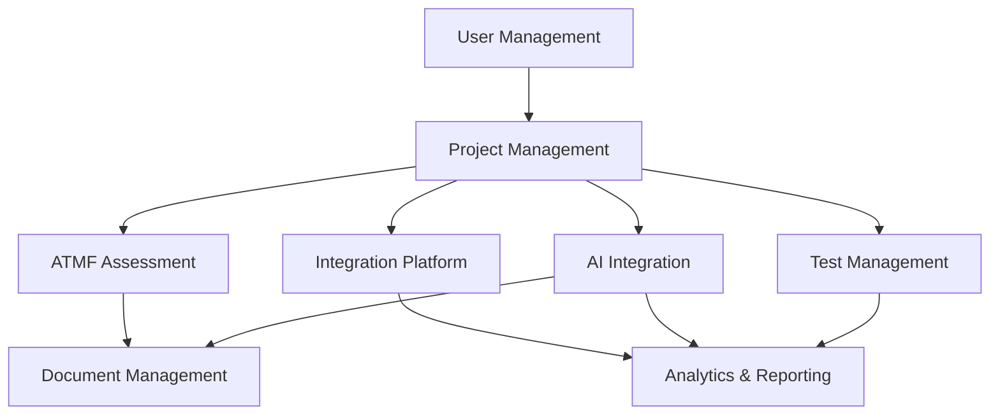

# ATMosFera Functional Areas Documentation

## Overview

This directory contains detailed documentation for each functional area of the ATMosFera platform. Each document provides comprehensive information about the purpose, features, workflows, and technical implementation of specific system components.

## Functional Areas

### 1. [User Management](./user-management.md)
- User authentication and authorization
- Role-based access control (RBAC)
- Profile management and preferences
- Session management and security

### 2. [Project Management](./project-management.md)
- Multi-tenant project isolation
- Project configuration and settings
- Team management and collaboration
- Project health monitoring

### 3. [ATMF Assessment System](./atmf-assessment.md)
- Adaptive Testing Maturity Framework implementation
- 6-dimension maturity evaluation
- AI-powered recommendations
- Progress tracking and roadmaps

### 4. [Test Management](./test-management.md)
- Test case authoring and management
- Test suite organization
- Test cycle execution
- Results tracking and reporting

### 5. [AI Integration](./ai-integration.md)
- Dual AI provider strategy (OpenAI + Anthropic)
- Contextual AI features
- Test generation and optimization
- Document generation and analysis

### 6. [Integration Platform](./integration-platform.md)
- Jira synchronization and management
- GitHub repository integration
- Webhook processing
- Health monitoring and status

### 7. [Analytics and Reporting](./analytics-reporting.md)
- Real-time dashboards
- Custom metrics and KPIs
- Automated report generation
- Data visualization and insights

### 8. [Document Management](./document-management.md)
- AI-powered document generation
- Version control and collaboration
- Template management
- Export and sharing capabilities

## Documentation Standards

Each functional area document follows this structure:

1. **Overview**: Purpose and scope of the functional area
2. **Key Features**: Main capabilities and functionalities
3. **User Workflows**: Step-by-step user interactions
4. **Technical Architecture**: Implementation details and components
5. **API Endpoints**: Available REST API endpoints
6. **Database Schema**: Relevant tables and relationships
7. **Configuration**: Settings and customization options
8. **Security Considerations**: Access control and data protection
9. **Performance Metrics**: KPIs and monitoring points
10. **Troubleshooting**: Common issues and resolutions

## Cross-Functional Dependencies

## Getting Started

To understand a specific functional area:

1. Read the overview section for context
2. Review key features and capabilities
3. Follow user workflows for practical understanding
4. Examine technical architecture for implementation details
5. Reference API documentation for integration

## Maintenance

These documents are maintained by the respective feature teams and reviewed monthly for accuracy and completeness. Any changes to functional requirements should be reflected in these documents within one week of implementation.

---

**Last Updated:** July 16, 2025  
**Owner:** Product Engineering Team