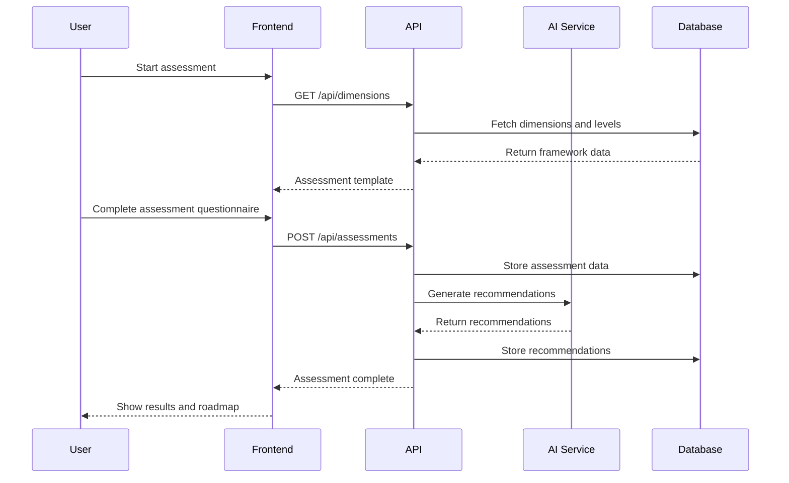
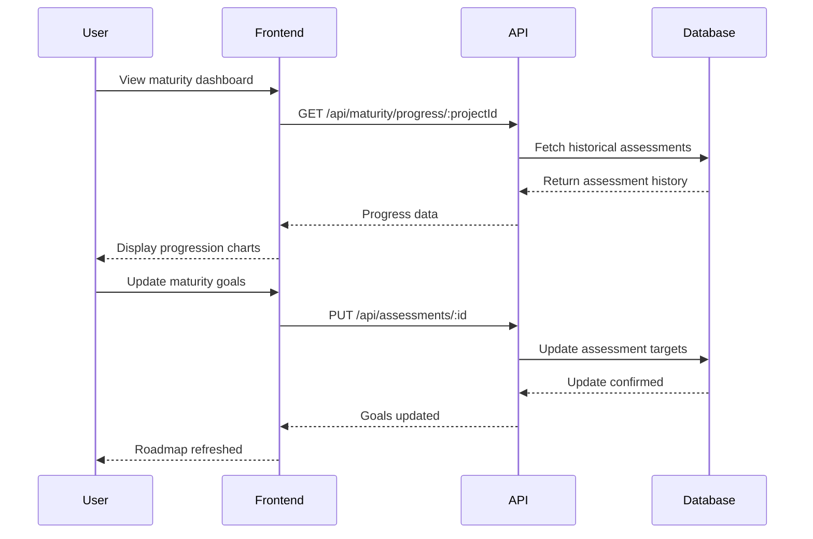

# ATMF Assessment System Functional Area

## 1. Overview

### 1.1 Purpose
The ATMF (Adaptive Testing Maturity Framework) Assessment System provides a comprehensive evaluation framework for testing maturity across six key dimensions. It delivers AI-powered recommendations, visual maturity roadmaps, and progression tracking to help organizations improve their testing practices systematically.

### 1.2 Scope
- Six-dimension maturity assessment framework
- Five-level maturity progression model
- AI-powered improvement recommendations
- Visual maturity roadmaps and dashboards
- Progress tracking and benchmarking
- Customizable assessment templates

### 1.3 Key Components
- Maturity dimension definitions
- Assessment questionnaire engine
- AI recommendation generator
- Progress tracking system
- Visualization and reporting
- Benchmarking and comparison tools

## 2. ATMF Framework Structure

### 2.1 Maturity Dimensions

#### 2.1.1 Automation Intelligence
**Focus**: Test automation maturity and intelligent tooling
- Automation coverage and effectiveness
- Tool integration and optimization
- AI-powered testing capabilities
- Continuous integration/deployment
- Smart test selection and execution

#### 2.1.2 Quality Engineering
**Focus**: Quality practices, culture, and engineering excellence
- Quality mindset and culture
- Engineering practices and standards
- Code quality and review processes
- Quality metrics and monitoring
- Continuous improvement practices

#### 2.1.3 Risk Management
**Focus**: Risk-based testing strategies and mitigation
- Risk identification and assessment
- Risk-based test planning
- Mitigation strategies and controls
- Monitoring and reporting
- Adaptive risk management

#### 2.1.4 Process Optimization
**Focus**: Testing process efficiency and optimization
- Process standardization and documentation
- Workflow optimization and automation
- Resource allocation and utilization
- Performance metrics and KPIs
- Continuous process improvement

#### 2.1.5 Team Collaboration
**Focus**: Cross-functional collaboration and communication
- Team communication and coordination
- Cross-functional collaboration
- Knowledge sharing and documentation
- Tool integration and workflow
- Stakeholder engagement

#### 2.1.6 Continuous Improvement
**Focus**: Learning, adaptation, and evolution practices
- Learning culture and practices
- Feedback loops and adaptation
- Innovation and experimentation
- Industry best practice adoption
- Organizational learning

### 2.2 Maturity Levels

1. **Foundation (Level 1)**: Basic practices established
   - Ad-hoc processes and practices
   - Limited documentation and standards
   - Basic tool usage
   - Individual-driven initiatives

2. **Developing (Level 2)**: Practices becoming systematic
   - Documented processes emerging
   - Basic metrics and measurement
   - Tool standardization beginning
   - Team-level coordination

3. **Defined (Level 3)**: Standardized and documented practices
   - Well-defined processes and procedures
   - Comprehensive documentation
   - Integrated tool chains
   - Cross-team collaboration

4. **Managed (Level 4)**: Quantitatively managed practices
   - Data-driven decision making
   - Advanced metrics and analytics
   - Predictive capabilities
   - Optimized processes

5. **Optimizing (Level 5)**: Continuously improving practices
   - Continuous innovation and improvement
   - Industry leadership and influence
   - Advanced AI and automation
   - Organizational excellence

## 3. User Workflows

### 3.1 Maturity Assessment Process


### 3.2 Progress Tracking


## 4. Technical Architecture

### 4.1 Assessment Data Model
```typescript
interface MaturityDimension {
  id: number;
  name: string;
  description: string;
  weight: number;
  createdAt: string;
}

interface MaturityLevel {
  id: number;
  dimensionId: number;
  level: number; // 1-5
  name: string;
  description: string;
  criteria: string[];
  createdAt: string;
}

interface Assessment {
  id: number;
  projectId: number;
  userId: number;
  dimensionId: number;
  currentLevel: number;
  targetLevel: number;
  evidence: string;
  notes: string;
  assessmentDate: string;
  createdAt: string;
}

interface Recommendation {
  id: number;
  title: string;
  description: string;
  category: string;
  priority: 'high' | 'medium' | 'low';
  projectId: number;
  dimensionId: number;
  status: 'active' | 'implemented' | 'dismissed';
  aiConfidence: number;
  implementationEffort: 'low' | 'medium' | 'high';
  expectedImpact: 'low' | 'medium' | 'high';
  createdAt: string;
  updatedAt: string;
}
```

### 4.2 AI Recommendation Engine
```typescript
interface RecommendationContext {
  assessment: Assessment;
  currentLevel: number;
  targetLevel: number;
  dimensionFocus: string;
  projectContext: {
    type: string;
    industry: string;
    teamSize: number;
    currentPractices: string[];
  };
  benchmarkData: {
    industryAverage: number;
    bestPractices: string[];
  };
}

async function generateMaturityRecommendations(
  context: RecommendationContext
): Promise<Recommendation[]> {
  // AI-powered recommendation generation logic
  // Analyzes current state, target state, and best practices
  // Returns prioritized, actionable recommendations
}
```

## 5. API Endpoints

### 5.1 Framework Structure

#### GET /api/dimensions
**Purpose**: Retrieve all maturity dimensions
**Response**: Array of MaturityDimension objects

#### GET /api/dimensions/:id/levels
**Purpose**: Get maturity levels for a specific dimension
**Response**: Array of MaturityLevel objects for the dimension

#### GET /api/levels
**Purpose**: Retrieve all maturity levels across dimensions
**Response**: Array of MaturityLevel objects

### 5.2 Assessment Management

#### GET /api/assessments
**Purpose**: Retrieve assessments with filtering
**Parameters**:
- `projectId`: Filter by project
- `dimensionId`: Filter by dimension
- `latest`: Get only latest assessments
**Response**: Array of Assessment objects

#### POST /api/assessments
**Purpose**: Create new maturity assessment
**Authentication**: Required
**Request Body**: Assessment object (without id, timestamps)
**Response**: Created assessment with generated recommendations

#### GET /api/assessments/:id
**Purpose**: Retrieve specific assessment with details
**Response**: Complete assessment object with related data

#### PUT /api/assessments/:id
**Purpose**: Update assessment (target levels, notes)
**Authentication**: Required
**Request Body**: Partial assessment object
**Response**: Updated assessment object

### 5.3 Recommendations

#### GET /api/recommendations
**Purpose**: Retrieve recommendations for project
**Parameters**:
- `projectId`: Required project filter
- `dimensionId`: Filter by dimension
- `status`: Filter by status
- `priority`: Filter by priority
**Response**: Array of Recommendation objects

#### POST /api/recommendations
**Purpose**: Create custom recommendation
**Authentication**: Required
**Request Body**: Recommendation object
**Response**: Created recommendation object

#### PUT /api/recommendations/:id
**Purpose**: Update recommendation status or details
**Authentication**: Required
**Request Body**: Partial recommendation object
**Response**: Updated recommendation object

### 5.4 Analytics and Reporting

#### GET /api/maturity/progress/:projectId
**Purpose**: Get maturity progression over time
**Response**: Historical assessment data with trend analysis

#### GET /api/maturity/benchmark/:projectId
**Purpose**: Compare project maturity to industry benchmarks
**Response**: Benchmark comparison data and insights

#### GET /api/maturity/roadmap/:projectId
**Purpose**: Generate maturity improvement roadmap
**Parameters**: `dimensionId`: Focus on specific dimension (optional)
**Response**: Prioritized improvement roadmap with timelines

### 5.5 AI-Enhanced Features

#### POST /api/ai/generate-recommendations
**Purpose**: Generate AI-powered improvement recommendations
**Authentication**: Required
**Request Body**:
```json
{
  "projectId": "number",
  "assessments": "Assessment[]",
  "focusAreas": "string[]",
  "timeframe": "string"
}
```
**Response**: Array of AI-generated recommendations

#### POST /api/ai/analyze-maturity
**Purpose**: Perform comprehensive maturity analysis
**Authentication**: Required
**Request Body**:
```json
{
  "projectId": "number",
  "includeIndustryBenchmarks": "boolean",
  "includeBestPractices": "boolean"
}
```
**Response**: Detailed maturity analysis with insights

## 6. Database Schema

### 6.1 Framework Tables
```sql
CREATE TABLE maturity_dimensions (
  id SERIAL PRIMARY KEY,
  name VARCHAR(100) NOT NULL,
  description TEXT,
  weight DECIMAL(3,2) DEFAULT 1.00,
  created_at TIMESTAMP DEFAULT CURRENT_TIMESTAMP
);

CREATE TABLE maturity_levels (
  id SERIAL PRIMARY KEY,
  dimension_id INTEGER REFERENCES maturity_dimensions(id) ON DELETE CASCADE,
  level INTEGER NOT NULL CHECK (level BETWEEN 1 AND 5),
  name VARCHAR(50) NOT NULL,
  description TEXT,
  criteria JSONB DEFAULT '[]',
  created_at TIMESTAMP DEFAULT CURRENT_TIMESTAMP
);
```

### 6.2 Assessment Tables
```sql
CREATE TABLE assessments (
  id SERIAL PRIMARY KEY,
  project_id INTEGER REFERENCES projects(id) ON DELETE CASCADE,
  user_id INTEGER REFERENCES users(id),
  dimension_id INTEGER REFERENCES maturity_dimensions(id),
  current_level INTEGER CHECK (current_level BETWEEN 1 AND 5),
  target_level INTEGER CHECK (target_level BETWEEN 1 AND 5),
  evidence TEXT,
  notes TEXT,
  assessment_date TIMESTAMP DEFAULT CURRENT_TIMESTAMP,
  created_at TIMESTAMP DEFAULT CURRENT_TIMESTAMP
);

CREATE TABLE recommendations (
  id SERIAL PRIMARY KEY,
  title VARCHAR(200) NOT NULL,
  description TEXT,
  category VARCHAR(50),
  priority VARCHAR(20) DEFAULT 'medium',
  project_id INTEGER REFERENCES projects(id) ON DELETE CASCADE,
  dimension_id INTEGER REFERENCES maturity_dimensions(id),
  status VARCHAR(30) DEFAULT 'active',
  ai_confidence DECIMAL(3,2),
  implementation_effort VARCHAR(20),
  expected_impact VARCHAR(20),
  created_at TIMESTAMP DEFAULT CURRENT_TIMESTAMP,
  updated_at TIMESTAMP DEFAULT CURRENT_TIMESTAMP
);
```

## 7. Configuration

### 7.1 Assessment Configuration
```typescript
interface AssessmentConfig {
  enableSelfAssessment: boolean;
  requireEvidence: boolean;
  mandatoryDimensions: number[];
  assessmentFrequency: 'monthly' | 'quarterly' | 'biannual' | 'annual';
  autoGenerateRecommendations: boolean;
  benchmarkComparison: boolean;
}
```

### 7.2 AI Recommendation Settings
```typescript
interface AIRecommendationConfig {
  enableAIRecommendations: boolean;
  confidenceThreshold: number;
  maxRecommendationsPerDimension: number;
  prioritizationWeights: {
    impact: number;
    effort: number;
    confidence: number;
  };
  industryBenchmarking: boolean;
}
```

## 8. Security Considerations

### 8.1 Assessment Data Protection
- **Project Isolation**: Assessment data isolated by project
- **Access Control**: Role-based access to assessment results
- **Data Encryption**: Sensitive assessment data encrypted
- **Audit Trail**: Complete audit log of assessment changes

### 8.2 Recommendation Security
- **AI Content Validation**: Validate AI-generated recommendations
- **Sensitive Information**: Filter out sensitive data from AI prompts
- **Recommendation Approval**: Review process for AI recommendations
- **Data Privacy**: Ensure compliance with privacy regulations

## 9. Performance Metrics

### 9.1 Assessment Metrics
- **Assessment Completion Rate**: Percentage of completed assessments
- **Maturity Progression**: Average level improvement over time
- **Dimension Coverage**: Assessment coverage across all dimensions
- **Target Achievement**: Percentage of maturity targets met

### 9.2 Recommendation Metrics
- **Recommendation Adoption**: Percentage of recommendations implemented
- **Implementation Success**: Success rate of implemented recommendations
- **Time to Implementation**: Average time from recommendation to implementation
- **AI Accuracy**: Quality rating of AI-generated recommendations

### 9.3 Business Impact Metrics
- **Testing Efficiency**: Improvement in testing productivity
- **Quality Improvement**: Reduction in defect rates
- **Process Optimization**: Efficiency gains from process improvements
- **ROI Measurement**: Return on investment from maturity improvements

## 10. Troubleshooting

### 10.1 Common Issues

#### Assessment Data Inconsistencies
**Symptom**: Inconsistent or missing assessment data
**Causes**:
- Incomplete assessment submissions
- Data validation failures
- Concurrent assessment updates
**Resolution**:
1. Implement comprehensive data validation
2. Add progress saving for partial assessments
3. Use database transactions for atomic updates
4. Provide clear error messages for validation failures

#### AI Recommendation Issues
**Symptom**: Poor quality or irrelevant recommendations
**Causes**:
- Insufficient context data
- AI service issues
- Outdated benchmark data
**Resolution**:
1. Enhance project context collection
2. Monitor AI service health and responses
3. Regular benchmark data updates
4. Implement recommendation feedback loop

#### Performance Issues
**Symptom**: Slow loading of maturity dashboards
**Causes**:
- Complex analytical queries
- Large assessment datasets
- Inefficient data aggregation
**Resolution**:
1. Implement caching for dashboard data
2. Add database indexes for analytical queries
3. Use materialized views for complex aggregations
4. Implement pagination for large datasets

### 10.2 Monitoring and Alerting
- **Assessment Completion Monitoring**: Track assessment progress
- **AI Service Monitoring**: Monitor AI recommendation generation
- **Performance Monitoring**: Track dashboard and API response times
- **Data Quality Monitoring**: Validate assessment data integrity

---

**Document Version:** 1.0  
**Last Updated:** July 16, 2025  
**Next Review:** August 16, 2025  
**Owner:** ATMF Framework Team