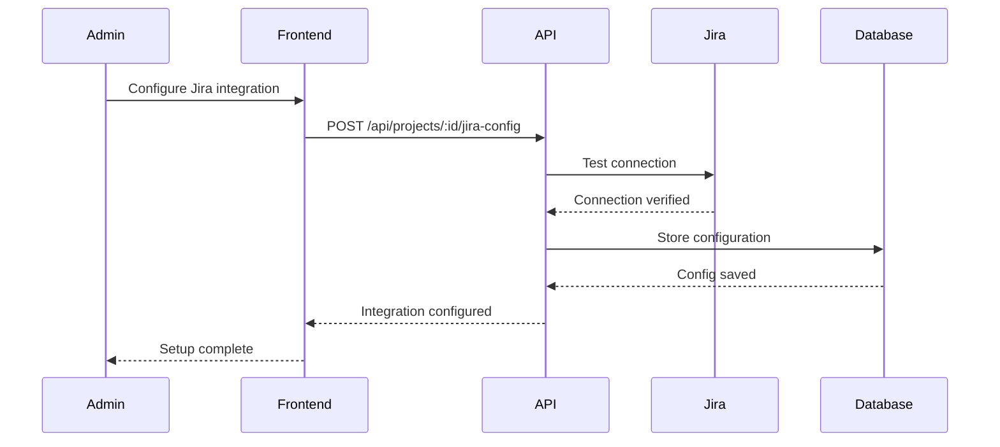
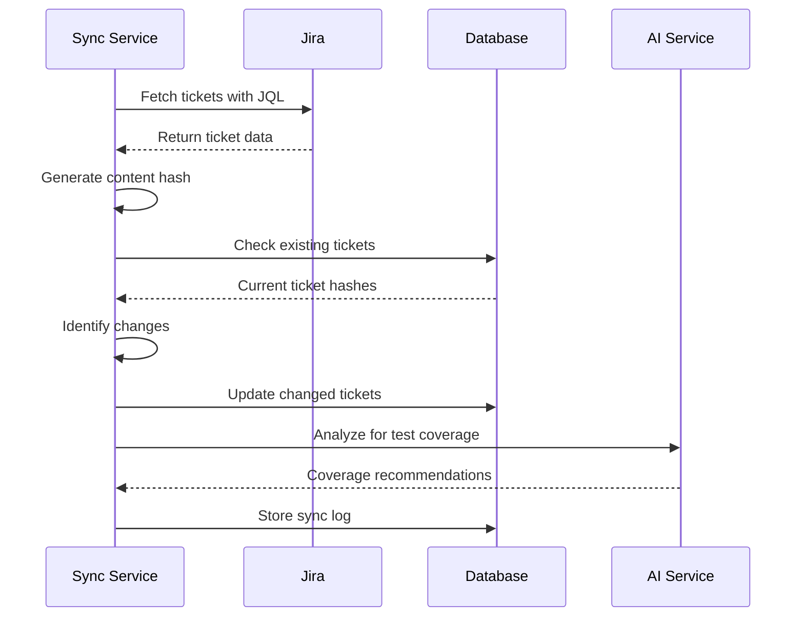
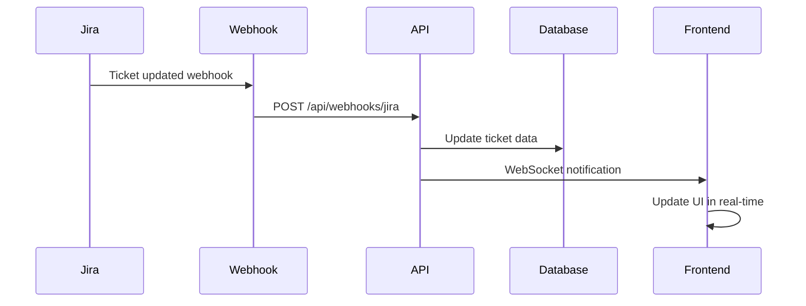

# Integration Platform Functional Area

## 1. Overview

### 1.1 Purpose
The Integration Platform provides seamless connectivity with external tools and systems, enabling bidirectional data synchronization, workflow automation, and enhanced context for AI features. It serves as the central hub for third-party tool integration within the ATMosFera ecosystem.

### 1.2 Scope
- Jira ticket synchronization and management
- GitHub repository integration and analysis
- Webhook processing and real-time updates
- Integration health monitoring and status
- Custom API integrations and extensions
- Data transformation and mapping

### 1.3 Key Components
- Jira integration service with smart synchronization
- GitHub integration for repository analysis
- Webhook management and processing system
- Integration health monitoring and alerting
- Data transformation and mapping engine
- API gateway and external service management

## 2. Jira Integration

### 2.1 Core Capabilities
- **Bidirectional Synchronization**: Real-time ticket data sync
- **Smart Caching**: Efficient data storage with change detection
- **Incremental Updates**: Optimized sync with content hash comparison
- **Bulk Operations**: Mass import/export capabilities
- **Field Mapping**: Configurable field mappings and transformations
- **Connection Health**: Continuous monitoring and status reporting

### 2.2 Synchronization Modes
1. **Full Sync**: Complete ticket data refresh
2. **Incremental Sync**: Updates only changed tickets
3. **Manual Sync**: On-demand synchronization
4. **Scheduled Sync**: Automated periodic updates
5. **Webhook Sync**: Real-time updates via webhooks

### 2.3 Data Management
- **Content Hash Tracking**: Detect changes efficiently
- **Sync Status Indicators**: Visual feedback on sync state
- **Error Recovery**: Automatic retry mechanisms
- **Data Validation**: Comprehensive data integrity checks
- **Audit Logging**: Complete sync activity tracking

### 2.4 Test Coverage Integration
- **Automatic Coverage Detection**: Map test cases to Jira tickets
- **Coverage Analysis**: Identify untested requirements
- **Gap Reporting**: Highlight coverage deficiencies
- **AI-Powered Mapping**: Intelligent test case suggestions

## 3. GitHub Integration

### 3.1 Repository Analysis
- **Code Structure Analysis**: Repository organization and architecture
- **Change Detection**: Monitor code changes and updates
- **Commit Analysis**: Track development activity and patterns
- **Branch Management**: Monitor branch strategies and workflows
- **Release Tracking**: Track release cycles and deployment patterns

### 3.2 Context Enhancement
- **AI Context Enrichment**: Provide code context for AI features
- **Test Case Correlation**: Link test cases to code components
- **Coverage Correlation**: Map test coverage to code coverage
- **Impact Analysis**: Analyze change impact on testing requirements

### 3.3 Workflow Integration
- **Pull Request Integration**: Link PRs to test cases
- **CI/CD Integration**: Connect with build and deployment pipelines
- **Release Notes**: Automated release documentation
- **Issue Tracking**: Link GitHub issues to test artifacts

## 4. User Workflows

### 4.1 Jira Integration Setup


### 4.2 Ticket Synchronization


### 4.3 Real-time Updates


## 5. Technical Architecture

### 5.1 Jira Service Implementation
```typescript
export class JiraService {
  private baseUrl: string;
  private auth: string;
  private retryConfig: RetryConfig;

  constructor(jiraUrl: string, apiKey: string) {
    this.baseUrl = jiraUrl.endsWith('/') ? jiraUrl.slice(0, -1) : jiraUrl;
    this.auth = Buffer.from(`${email}:${apiKey}`).toString('base64');
    this.retryConfig = {
      maxAttempts: 3,
      backoffMs: 1000,
      maxBackoffMs: 5000
    };
  }

  async testConnection(): Promise<boolean> {
    try {
      await this.makeRequest('/rest/api/2/myself');
      return true;
    } catch (error) {
      console.error('Jira connection test failed:', error);
      return false;
    }
  }

  async fetchIssues(jql: string, maxResults: number = 100): Promise<JiraIssue[]> {
    const response = await this.makeRequest(
      `/rest/api/2/search?jql=${encodeURIComponent(jql)}&maxResults=${maxResults}&expand=renderedFields`
    );
    return response.issues;
  }

  async syncTickets(project: Project, syncType: SyncType): Promise<SyncResult> {
    const startTime = Date.now();
    const syncLog = await this.createSyncLog(project.id, syncType);
    
    try {
      const jql = this.buildJQL(project, syncType);
      const jiraIssues = await this.fetchIssues(jql);
      
      let processed = 0;
      let created = 0;
      let updated = 0;
      
      for (const issue of jiraIssues) {
        const result = await this.processTicket(issue, project.id);
        processed++;
        if (result.action === 'created') created++;
        if (result.action === 'updated') updated++;
      }
      
      await this.completeSyncLog(syncLog.id, {
        status: 'completed',
        ticketsProcessed: processed,
        ticketsCreated: created,
        ticketsUpdated: updated,
        completedAt: new Date()
      });
      
      return {
        success: true,
        processed,
        created,
        updated,
        duration: Date.now() - startTime
      };
    } catch (error) {
      await this.failSyncLog(syncLog.id, error.message);
      throw error;
    }
  }

  private async processTicket(issue: JiraIssue, projectId: number): Promise<ProcessResult> {
    const contentHash = this.generateContentHash(issue);
    const existingTicket = await this.findExistingTicket(issue.key, projectId);
    
    if (!existingTicket) {
      const dbTicket = this.convertToDbFormat(issue, projectId);
      await db.insert(jiraTickets).values(dbTicket);
      return { action: 'created', ticket: dbTicket };
    }
    
    if (existingTicket.contentHash !== contentHash) {
      const updates = this.convertToDbFormat(issue, projectId);
      await db.update(jiraTickets)
        .set({ ...updates, updatedAt: new Date().toISOString() })
        .where(eq(jiraTickets.id, existingTicket.id));
      return { action: 'updated', ticket: updates };
    }
    
    return { action: 'skipped', ticket: existingTicket };
  }
}
```

### 5.2 GitHub Integration Service
```typescript
export class GitHubService {
  private octokit: Octokit;
  private owner: string;
  private repo: string;

  constructor(token: string, repository: string) {
    this.octokit = new Octokit({ auth: token });
    [this.owner, this.repo] = repository.split('/');
  }

  async analyzeRepository(): Promise<RepositoryAnalysis> {
    const [repoData, languages, structure] = await Promise.all([
      this.getRepositoryData(),
      this.getLanguages(),
      this.getDirectoryStructure()
    ]);

    return {
      repository: repoData,
      languages,
      structure,
      analysis: {
        complexity: this.calculateComplexity(structure),
        testCoverage: await this.estimateTestCoverage(structure),
        architecture: this.analyzeArchitecture(structure)
      }
    };
  }

  async getRecentCommits(since: Date): Promise<CommitData[]> {
    const { data: commits } = await this.octokit.rest.repos.listCommits({
      owner: this.owner,
      repo: this.repo,
      since: since.toISOString()
    });

    return commits.map(commit => ({
      sha: commit.sha,
      message: commit.commit.message,
      author: commit.commit.author,
      date: commit.commit.author.date,
      changes: commit.stats
    }));
  }

  async getPullRequests(state: 'open' | 'closed' | 'all' = 'all'): Promise<PullRequestData[]> {
    const { data: prs } = await this.octokit.rest.pulls.list({
      owner: this.owner,
      repo: this.repo,
      state
    });

    return prs.map(pr => ({
      number: pr.number,
      title: pr.title,
      state: pr.state,
      createdAt: pr.created_at,
      updatedAt: pr.updated_at,
      author: pr.user.login,
      labels: pr.labels.map(label => label.name)
    }));
  }
}
```

### 5.3 Webhook Processing System
```typescript
export class WebhookProcessor {
  private handlers: Map<string, WebhookHandler> = new Map();

  registerHandler(eventType: string, handler: WebhookHandler): void {
    this.handlers.set(eventType, handler);
  }

  async processWebhook(payload: WebhookPayload, signature: string): Promise<void> {
    // Verify webhook signature
    if (!this.verifySignature(payload, signature)) {
      throw new Error('Invalid webhook signature');
    }

    const handler = this.handlers.get(payload.eventType);
    if (!handler) {
      console.warn(`No handler registered for event type: ${payload.eventType}`);
      return;
    }

    try {
      await handler.process(payload);
      await this.logWebhookEvent(payload, 'processed');
    } catch (error) {
      await this.logWebhookEvent(payload, 'failed', error.message);
      throw error;
    }
  }

  private verifySignature(payload: WebhookPayload, signature: string): boolean {
    // Implement signature verification logic
    const expectedSignature = crypto
      .createHmac('sha256', process.env.WEBHOOK_SECRET)
      .update(JSON.stringify(payload))
      .digest('hex');
    
    return signature === `sha256=${expectedSignature}`;
  }
}

// Jira Webhook Handler
export class JiraWebhookHandler implements WebhookHandler {
  async process(payload: JiraWebhookPayload): Promise<void> {
    const { issue, changeLog } = payload;
    
    if (issue) {
      await this.updateTicketData(issue);
    }
    
    if (changeLog) {
      await this.processChangeLog(issue.key, changeLog);
    }
    
    // Notify connected clients via WebSocket
    await this.notifyClients({
      type: 'jira_update',
      issueKey: issue.key,
      changes: changeLog?.items || []
    });
  }
}
```

## 6. API Endpoints

### 6.1 Jira Integration Endpoints

#### POST /api/projects/:id/jira-config
**Purpose**: Configure Jira integration for project
**Authentication**: Required (admin/manager)
**Request Body**:
```json
{
  "jiraUrl": "string",
  "apiKey": "string",
  "email": "string",
  "projectKey": "string",
  "jql": "string"
}
```
**Response**: Configuration confirmation

#### POST /api/projects/:id/jira-test-connection
**Purpose**: Test Jira connection and credentials
**Authentication**: Required
**Response**: Connection status and details

#### GET /api/projects/:id/jira-tickets
**Purpose**: Retrieve synchronized Jira tickets
**Parameters**:
- `status`: Filter by ticket status
- `assignee`: Filter by assignee
- `labels`: Filter by labels
- `search`: Search in summary/description
**Response**: Array of JiraTicket objects

#### POST /api/projects/:id/jira-sync
**Purpose**: Trigger Jira synchronization
**Authentication**: Required
**Request Body**:
```json
{
  "syncType": "full|incremental|manual",
  "jql": "string (optional)"
}
```
**Response**: Sync initiation confirmation

#### GET /api/projects/:id/jira-sync-logs
**Purpose**: Get synchronization history and status
**Response**: Array of sync log objects

### 6.2 GitHub Integration Endpoints

#### POST /api/projects/:id/github-config
**Purpose**: Configure GitHub integration
**Authentication**: Required (admin/manager)
**Request Body**:
```json
{
  "repository": "string",
  "accessToken": "string",
  "webhookUrl": "string"
}
```
**Response**: Configuration confirmation

#### GET /api/projects/:id/github-analysis
**Purpose**: Get repository analysis data
**Response**: Repository analysis object

#### GET /api/projects/:id/github-commits
**Purpose**: Get recent commit data
**Parameters**: `since`: Date filter for commits
**Response**: Array of commit objects

#### POST /api/projects/:id/github-webhook
**Purpose**: Process GitHub webhook events
**Request Body**: GitHub webhook payload
**Response**: Processing confirmation

### 6.3 Webhook Management Endpoints

#### GET /api/webhooks/status
**Purpose**: Get webhook processing status
**Response**: Webhook system health and statistics

#### POST /api/webhooks/jira
**Purpose**: Process Jira webhook events
**Request Body**: Jira webhook payload
**Response**: Processing confirmation

#### POST /api/webhooks/github
**Purpose**: Process GitHub webhook events
**Request Body**: GitHub webhook payload
**Response**: Processing confirmation

### 6.4 Integration Health Endpoints

#### GET /api/integrations/health
**Purpose**: Get overall integration health status
**Response**: Health status for all integrations

#### GET /api/integrations/metrics
**Purpose**: Get integration usage and performance metrics
**Response**: Integration metrics and statistics

## 7. Database Schema

### 7.1 Jira Integration Tables
```sql
CREATE TABLE jira_tickets (
  id SERIAL PRIMARY KEY,
  project_id INTEGER REFERENCES projects(id) ON DELETE CASCADE,
  jira_key VARCHAR(50) NOT NULL,
  issue_type VARCHAR(50),
  summary TEXT NOT NULL,
  description TEXT,
  priority VARCHAR(50),
  status VARCHAR(50) NOT NULL,
  assignee VARCHAR(100),
  reporter VARCHAR(100),
  labels JSONB DEFAULT '[]',
  components JSONB DEFAULT '[]',
  created_date TIMESTAMP,
  updated_date TIMESTAMP,
  content_hash VARCHAR(64),
  last_synced TIMESTAMP DEFAULT CURRENT_TIMESTAMP,
  created_at TIMESTAMP DEFAULT CURRENT_TIMESTAMP,
  updated_at TIMESTAMP DEFAULT CURRENT_TIMESTAMP
);

CREATE TABLE jira_sync_logs (
  id SERIAL PRIMARY KEY,
  project_id INTEGER REFERENCES projects(id) ON DELETE CASCADE,
  sync_type VARCHAR(20) NOT NULL,
  status VARCHAR(20) NOT NULL,
  tickets_processed INTEGER DEFAULT 0,
  tickets_created INTEGER DEFAULT 0,
  tickets_updated INTEGER DEFAULT 0,
  error_message TEXT,
  started_at TIMESTAMP DEFAULT CURRENT_TIMESTAMP,
  completed_at TIMESTAMP,
  created_at TIMESTAMP DEFAULT CURRENT_TIMESTAMP
);

CREATE TABLE test_case_jira_links (
  id SERIAL PRIMARY KEY,
  test_case_id INTEGER REFERENCES test_cases(id) ON DELETE CASCADE,
  jira_ticket_id INTEGER REFERENCES jira_tickets(id) ON DELETE CASCADE,
  link_type VARCHAR(30) DEFAULT 'covers',
  created_at TIMESTAMP DEFAULT CURRENT_TIMESTAMP
);
```

### 7.2 Integration Configuration Table
```sql
CREATE TABLE integration_configs (
  id SERIAL PRIMARY KEY,
  project_id INTEGER REFERENCES projects(id) ON DELETE CASCADE,
  integration_type VARCHAR(50) NOT NULL,
  config_data JSONB NOT NULL,
  is_active BOOLEAN DEFAULT true,
  last_tested TIMESTAMP,
  test_status VARCHAR(20),
  created_at TIMESTAMP DEFAULT CURRENT_TIMESTAMP,
  updated_at TIMESTAMP DEFAULT CURRENT_TIMESTAMP
);
```

### 7.3 Webhook Events Table
```sql
CREATE TABLE webhook_events (
  id SERIAL PRIMARY KEY,
  integration_type VARCHAR(50) NOT NULL,
  event_type VARCHAR(100) NOT NULL,
  payload JSONB NOT NULL,
  signature VARCHAR(255),
  processed_at TIMESTAMP,
  status VARCHAR(20) DEFAULT 'pending',
  error_message TEXT,
  created_at TIMESTAMP DEFAULT CURRENT_TIMESTAMP
);
```

## 8. Configuration

### 8.1 Integration Settings
```typescript
interface IntegrationConfig {
  jira: {
    enabled: boolean;
    defaultSyncInterval: number; // minutes
    maxRetries: number;
    timeoutMs: number;
    batchSize: number;
    autoSync: boolean;
  };
  github: {
    enabled: boolean;
    analysisDepth: 'shallow' | 'deep';
    commitAnalysisLimit: number;
    webhookSecret: string;
    rateLimitBuffer: number;
  };
  webhooks: {
    enabled: boolean;
    retryPolicy: {
      maxAttempts: number;
      backoffMs: number;
      maxBackoffMs: number;
    };
    signatureValidation: boolean;
    queueProcessing: boolean;
  };
}
```

### 8.2 Security Configuration
```typescript
interface SecurityConfig {
  encryption: {
    algorithm: string;
    keyRotationDays: number;
    saltRounds: number;
  };
  authentication: {
    tokenExpiration: number;
    maxTokensPerUser: number;
    rateLimiting: {
      windowMs: number;
      maxRequests: number;
    };
  };
  dataValidation: {
    maxPayloadSize: number;
    sanitizeInput: boolean;
    validateSignatures: boolean;
  };
}
```

## 9. Security Considerations

### 9.1 API Key Management
- **Secure Storage**: Encrypted storage of third-party API keys
- **Key Rotation**: Regular rotation of authentication tokens
- **Access Control**: Role-based access to integration configuration
- **Audit Logging**: Track all integration configuration changes

### 9.2 Data Security
- **Transmission Encryption**: HTTPS for all external API calls
- **Data Sanitization**: Clean incoming data before storage
- **Input Validation**: Comprehensive validation of webhook payloads
- **Rate Limiting**: Prevent abuse and DOS attacks

### 9.3 Webhook Security
- **Signature Verification**: Validate webhook signatures
- **Source Validation**: Verify webhook source authenticity
- **Payload Limits**: Enforce maximum payload sizes
- **Error Handling**: Secure error responses without data leakage

## 10. Performance Metrics

### 10.1 Synchronization Metrics
- **Sync Success Rate**: Percentage of successful synchronizations
- **Sync Duration**: Average time for sync operations
- **Data Volume**: Number of tickets/commits processed
- **Error Rate**: Failed synchronization attempts

### 10.2 Integration Health Metrics
- **API Response Times**: Third-party service response times
- **Connection Uptime**: Integration availability percentage
- **Data Freshness**: Age of synchronized data
- **Webhook Processing**: Webhook event processing times

### 10.3 Usage Metrics
- **Feature Adoption**: Usage statistics for integration features
- **User Engagement**: User interaction with integrated data
- **Coverage Impact**: Test coverage improvements from integrations
- **Productivity Gains**: Time savings from automation

## 11. Troubleshooting

### 11.1 Common Issues

#### Jira Connection Failures
**Symptom**: Cannot connect to Jira or sync fails
**Causes**:
- Invalid API credentials
- Network connectivity issues
- Jira server downtime
- Rate limiting or quota exceeded
**Resolution**:
1. Verify API credentials and permissions
2. Test network connectivity to Jira instance
3. Check Jira service status
4. Review rate limiting configuration

#### GitHub Integration Issues
**Symptom**: Repository data not updating or webhooks failing
**Causes**:
- Invalid GitHub token
- Repository access permissions
- Webhook configuration errors
- Rate limiting
**Resolution**:
1. Validate GitHub token permissions
2. Check repository access rights
3. Verify webhook configuration and URL
4. Monitor GitHub API rate limits

#### Data Synchronization Problems
**Symptom**: Data inconsistencies or sync delays
**Causes**:
- Concurrent sync operations
- Large data volumes
- Database performance issues
- Network timeouts
**Resolution**:
1. Implement sync operation locking
2. Optimize batch processing and pagination
3. Monitor database performance and queries
4. Adjust timeout configurations

### 11.2 Monitoring and Alerting
- **Integration Health Monitoring**: Continuous health checks
- **Performance Monitoring**: Track response times and throughput
- **Error Rate Monitoring**: Alert on high error rates
- **Data Quality Monitoring**: Validate synchronized data integrity

### 11.3 Recovery Procedures
- **Failed Sync Recovery**: Automatic retry mechanisms
- **Data Corruption Recovery**: Backup and restore procedures
- **Configuration Recovery**: Backup integration settings
- **Service Recovery**: Failover and redundancy strategies

---

**Document Version:** 1.0  
**Last Updated:** July 16, 2025  
**Next Review:** August 16, 2025  
**Owner:** Integration Platform Team