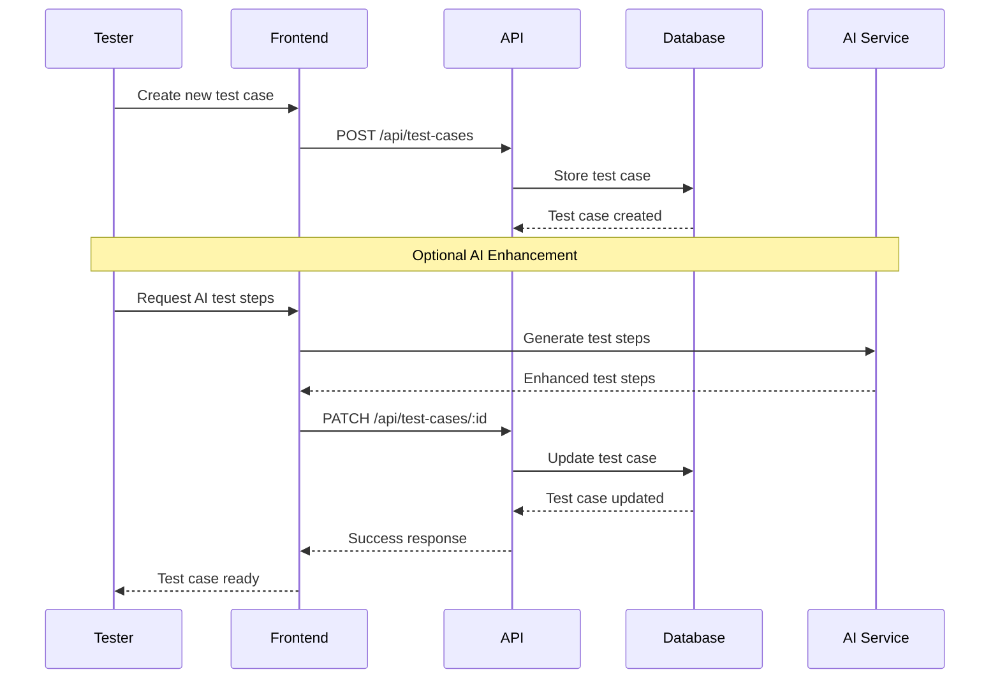
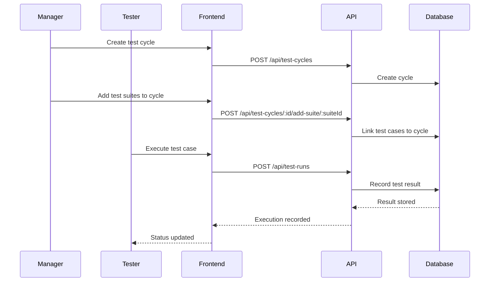
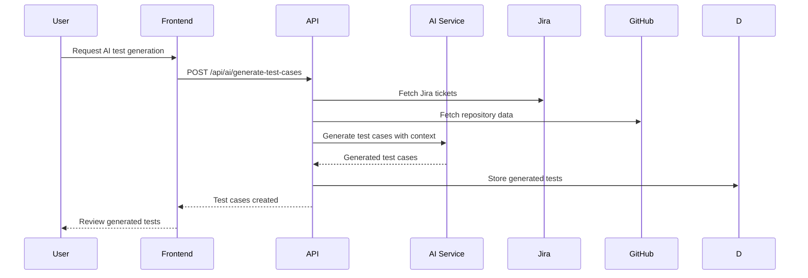

# Test Management Functional Area

## 1. Overview

### 1.1 Purpose
The Test Management system provides comprehensive test lifecycle management capabilities including test case authoring, test suite organization, test cycle execution, and results tracking. It serves as the core testing workflow engine for the ATMosFera platform.

### 1.2 Scope
- Test case creation and management
- Test suite organization and hierarchy
- Test cycle planning and execution
- Test results tracking and reporting
- Test automation integration
- Collaborative testing workflows

### 1.3 Key Components
- Test case authoring system
- Test suite management
- Test cycle execution engine
- Results tracking and analytics
- Integration with AI features
- Collaboration and commenting system

## 2. Key Features

### 2.1 Test Case Management
- **Rich Text Authoring**: Comprehensive test case creation with formatting
- **Step-by-Step Testing**: Detailed test steps with expected results
- **Attachments Support**: File uploads and evidence management
- **Version Control**: Test case versioning and change tracking
- **AI Enhancement**: AI-powered test case generation and optimization
- **Automation Tagging**: Mark test cases for automation potential

### 2.2 Test Suite Organization
- **Hierarchical Structure**: Logical grouping of related test cases
- **Project Area Mapping**: Organize by functional areas
- **Priority Classification**: High/Medium/Low priority assignment
- **Status Tracking**: Active/Deprecated/Draft status management
- **Coverage Requirements**: Define coverage criteria and goals
- **AI-Generated Suites**: Automated test suite creation based on requirements

### 2.3 Test Cycle Execution
- **Enhanced Cycle Planning**: Structured test execution campaigns with AI readiness features
- **Testing Mode Selection**: Manual, AI-assisted manual, or automated execution modes
- **Deployment Integration**: Test deployment URL configuration for AI and manual testing
- **Test Data Management**: Structured test data configuration with key-value pairs and descriptions
- **Assignment Management**: Assign test cases to team members with role-based access
- **Execution Tracking**: Real-time execution status monitoring with enhanced analytics
- **Results Recording**: Detailed pass/fail/blocked result tracking with evidence
- **Evidence Collection**: Screenshots, logs, and attachments with automated uploads
- **Defect Integration**: Link test failures to defect tracking systems (Jira integration)
- **AI-Assisted Execution**: Intelligent test execution guidance and anomaly detection

### 2.4 Collaborative Features
- **Real-time Updates**: Live collaboration during test execution
- **Comments and Notes**: Rich commenting system for test cases
- **Team Assignment**: Assign test cases to specific team members
- **Review Workflow**: Test case review and approval process
- **Notification System**: Automated alerts for status changes

## 3. User Workflows

### 3.1 Test Case Creation


### 3.2 Test Cycle Execution


### 3.3 AI-Powered Test Generation


## 4. Technical Architecture

### 4.1 Test Case Data Model
```typescript
interface TestCase {
  id: number;
  title: string;
  description?: string;
  preconditions?: string;
  steps: TestStep[];
  expectedResults?: string;
  actualResults?: string;
  priority: 'high' | 'medium' | 'low';
  severity: 'critical' | 'high' | 'normal' | 'low';
  status: 'draft' | 'ready' | 'in-progress' | 'passed' | 'failed';
  suiteId?: number;
  userId?: number;
  aiGenerated: boolean;
  automatable?: boolean;
  automationStatus?: 'not-automated' | 'in-progress' | 'automated';
  testData: Record<string, any>;
  projectId: number;
  createdAt: string;
  updatedAt: string;
}

interface TestStep {
  step: string;
  expected: string;
}
```

### 4.2 Test Suite Organization
```typescript
interface TestSuite {
  id: number;
  name: string;
  description?: string;
  projectArea?: string;
  priority: 'high' | 'medium' | 'low';
  status: 'active' | 'deprecated' | 'draft';
  coverageRequirements: string[];
  aiGenerated: boolean;
  tags: string[];
  projectId: number;
  testCases?: TestCase[];
}
```

### 4.3 Test Execution Model
```typescript
interface TestCycle {
  id: number;
  name: string;
  description?: string;
  status: 'created' | 'in-progress' | 'completed' | 'archived';
  startDate?: string;
  endDate?: string;
  userId?: number;
  projectId: number;
}

interface TestCycleItem {
  id: number;
  cycleId: number;
  testCaseId: number;
  suiteId?: number;
  assignedUserId?: number;
  status: 'not-run' | 'pass' | 'fail' | 'skip' | 'blocked';
}

interface TestRun {
  id: number;
  cycleItemId: number;
  executedBy?: number;
  executedAt: string;
  duration?: number;
  status: 'pass' | 'fail' | 'skip' | 'blocked' | 'cancelled';
  notes?: string;
  evidence: any[];
  environment?: string;
  version?: string;
  stepResults: StepResult[];
  defects: any[];
  tags: string[];
}
```

## 5. API Endpoints

### 5.1 Test Case Management

#### GET /api/test-cases
**Purpose**: Retrieve test cases with filtering and pagination
**Parameters**:
- `projectId`: Filter by project
- `suiteId`: Filter by test suite
- `status`: Filter by status
- `priority`: Filter by priority
- `search`: Search term for title/description
**Response**: Array of test case objects

#### POST /api/test-cases
**Purpose**: Create a new test case
**Authentication**: Required
**Request Body**: TestCase object (without id, timestamps)
**Response**: Created test case object

#### GET /api/test-cases/:id
**Purpose**: Retrieve specific test case with full details
**Response**: Complete test case object with related data

#### PATCH /api/test-cases/:id
**Purpose**: Update test case fields
**Authentication**: Required
**Request Body**: Partial test case object
**Response**: Updated test case object

#### DELETE /api/test-cases/:id
**Purpose**: Delete test case
**Authentication**: Required (admin/manager)
**Response**: Success confirmation

### 5.2 Test Suite Management

#### GET /api/test-suites
**Purpose**: Retrieve test suites for a project
**Parameters**:
- `projectId`: Required project filter
- `status`: Filter by status
**Response**: Array of test suite objects

#### POST /api/test-suites
**Purpose**: Create new test suite
**Authentication**: Required
**Request Body**: TestSuite object (without id, timestamps)
**Response**: Created test suite object

#### PUT /api/test-suites/:id
**Purpose**: Update test suite
**Authentication**: Required
**Request Body**: Complete test suite object
**Response**: Updated test suite object

#### DELETE /api/test-suites/:id
**Purpose**: Delete test suite and associated test cases
**Authentication**: Required (admin/manager)
**Response**: Success confirmation

### 5.3 Enhanced Test Cycle Management

#### GET /api/test-cycles
**Purpose**: Retrieve test cycles for a project
**Parameters**: `projectId`: Filter by project
**Response**: Array of test cycle objects

#### POST /api/test-cycles
**Purpose**: Create new test cycle with enhanced AI readiness features
**Authentication**: Required
**Request Body**: Enhanced TestCycle object
```json
{
  "name": "string",
  "description": "string",
  "status": "created|in-progress|completed|archived",
  "startDate": "ISO8601 timestamp",
  "endDate": "ISO8601 timestamp",
  "testingMode": "manual|ai-assisted-manual|automated",
  "testDeploymentUrl": "string",
  "testData": {
    "key1": {
      "value": "string",
      "description": "string"
    }
  },
  "projectId": "number"
}
```
**Response**: Created test cycle object with enhanced fields

#### GET /api/test-cycle-items/:cycleId
**Purpose**: Get test cases assigned to a cycle
**Response**: Array of test cycle item objects

#### POST /api/test-cycles/:cycleId/add-test-cases
**Purpose**: Add individual test cases to cycle
**Authentication**: Required
**Request Body**: `{ testCaseIds: number[] }`
**Response**: Array of created test cycle items

#### POST /api/test-cycles/:cycleId/add-suite/:suiteId
**Purpose**: Add all test cases from suite to cycle
**Authentication**: Required
**Response**: Array of created test cycle items

#### PUT /api/test-cycles/:id
**Purpose**: Update existing test cycle with enhanced fields
**Authentication**: Required
**Request Body**: Complete enhanced TestCycle object
**Response**: Updated test cycle object

#### DELETE /api/test-cycles/:id
**Purpose**: Delete test cycle and associated items
**Authentication**: Required (admin/manager)
**Response**: Success confirmation

### 5.4 Test Execution

#### POST /api/test-runs
**Purpose**: Record test execution result
**Authentication**: Required
**Request Body**: TestRun object
**Response**: Created test run object

#### GET /api/test-runs/test-case/:testCaseId
**Purpose**: Get execution history for test case
**Response**: Array of test run objects

#### GET /api/test-runs/cycle/:cycleId
**Purpose**: Get all test runs for a cycle
**Response**: Array of test run objects with aggregated data

### 5.5 AI-Enhanced Features

#### POST /api/ai/generate-test-cases
**Purpose**: Generate test cases using AI
**Authentication**: Required
**Request Body**:
```json
{
  "projectId": "number",
  "requirements": "string",
  "suiteId": "number",
  "includeDocuments": "boolean",
  "includeJira": "boolean"
}
```
**Response**: Array of generated test case objects

#### POST /api/ai/generate-test-steps
**Purpose**: Generate detailed test steps for existing test case
**Authentication**: Required
**Request Body**:
```json
{
  "projectId": "number",
  "testCase": "TestCase object",
  "includeDocuments": "boolean",
  "includeJira": "boolean"
}
```
**Response**: Enhanced test case with detailed steps

#### POST /api/ai/generate-test-coverage
**Purpose**: Analyze and propose test coverage improvements
**Authentication**: Required
**Request Body**:
```json
{
  "projectId": "number",
  "jiraTickets": "JiraTicket[]",
  "context": "string"
}
```
**Response**: Array of proposed test case objects

## 6. Database Schema

### 6.1 Test Cases Table
```sql
CREATE TABLE test_cases (
  id SERIAL PRIMARY KEY,
  title VARCHAR(200) NOT NULL,
  description TEXT,
  preconditions TEXT,
  steps JSONB DEFAULT '[]',
  expected_results TEXT,
  actual_results TEXT,
  priority VARCHAR(20) DEFAULT 'medium',
  severity VARCHAR(20) DEFAULT 'normal',
  status VARCHAR(30) DEFAULT 'draft',
  suite_id INTEGER REFERENCES test_suites(id) ON DELETE SET NULL,
  user_id INTEGER REFERENCES users(id),
  ai_generated BOOLEAN DEFAULT false,
  automatable BOOLEAN,
  automation_status VARCHAR(30),
  test_data JSONB DEFAULT '{}',
  created_at TIMESTAMP DEFAULT CURRENT_TIMESTAMP,
  updated_at TIMESTAMP DEFAULT CURRENT_TIMESTAMP,
  project_id INTEGER REFERENCES projects(id) ON DELETE CASCADE
);
```

### 6.2 Test Suites Table
```sql
CREATE TABLE test_suites (
  id SERIAL PRIMARY KEY,
  name VARCHAR(100) NOT NULL,
  description TEXT,
  project_area VARCHAR(50),
  priority VARCHAR(20) DEFAULT 'medium',
  status VARCHAR(30) DEFAULT 'active',
  coverage_requirements JSONB DEFAULT '[]',
  ai_generated BOOLEAN DEFAULT false,
  tags JSONB DEFAULT '[]',
  created_at TIMESTAMP DEFAULT CURRENT_TIMESTAMP,
  updated_at TIMESTAMP DEFAULT CURRENT_TIMESTAMP,
  project_id INTEGER REFERENCES projects(id) ON DELETE CASCADE
);
```

### 6.3 Enhanced Test Cycles and Execution Tables
```sql
CREATE TABLE test_cycles (
  id SERIAL PRIMARY KEY,
  name VARCHAR(100) NOT NULL,
  description TEXT,
  status VARCHAR(30) DEFAULT 'created',
  start_date TIMESTAMP,
  end_date TIMESTAMP,
  user_id INTEGER REFERENCES users(id),
  -- Enhanced fields for AI Assisted Execution Readiness
  testing_mode VARCHAR(30) DEFAULT 'manual',
  test_deployment_url TEXT,
  test_data JSONB DEFAULT '{}',
  created_at TIMESTAMP DEFAULT CURRENT_TIMESTAMP,
  updated_at TIMESTAMP DEFAULT CURRENT_TIMESTAMP,
  project_id INTEGER REFERENCES projects(id) ON DELETE CASCADE
);

CREATE TABLE test_cycle_items (
  id SERIAL PRIMARY KEY,
  cycle_id INTEGER NOT NULL REFERENCES test_cycles(id) ON DELETE CASCADE,
  test_case_id INTEGER NOT NULL REFERENCES test_cases(id) ON DELETE CASCADE,
  suite_id INTEGER REFERENCES test_suites(id) ON DELETE SET NULL,
  assigned_user_id INTEGER REFERENCES users(id),
  status VARCHAR(30) DEFAULT 'not-run',
  created_at TIMESTAMP DEFAULT CURRENT_TIMESTAMP,
  updated_at TIMESTAMP DEFAULT CURRENT_TIMESTAMP
);

CREATE TABLE test_runs (
  id SERIAL PRIMARY KEY,
  cycle_item_id INTEGER NOT NULL REFERENCES test_cycle_items(id) ON DELETE CASCADE,
  executed_by INTEGER REFERENCES users(id),
  executed_at TIMESTAMP DEFAULT CURRENT_TIMESTAMP,
  duration INTEGER,
  status VARCHAR(30) NOT NULL,
  notes TEXT,
  evidence JSONB DEFAULT '[]',
  environment VARCHAR(50),
  version VARCHAR(50),
  step_results JSONB DEFAULT '[]',
  defects JSONB DEFAULT '[]',
  tags JSONB DEFAULT '[]'
);
```

**Enhanced Test Cycle Features:**
- **Testing Mode**: Supports manual, ai-assisted-manual, and automated execution strategies
- **Test Deployment URL**: Direct links to staging/test environments for execution context
- **Test Data Configuration**: Structured test data storage with descriptions for AI context

## 7. Configuration

### 7.1 Test Management Settings
```typescript
interface TestManagementConfig {
  defaultPriority: 'high' | 'medium' | 'low';
  defaultSeverity: 'critical' | 'high' | 'normal' | 'low';
  allowParallelExecution: boolean;
  maxAttachmentSize: number; // in MB
  autoAssignCreator: boolean;
  requireEvidence: boolean;
  notificationSettings: {
    onTestFailure: boolean;
    onCycleCompletion: boolean;
    onStatusChange: boolean;
  };
}
```

### 7.2 AI Integration Settings
```typescript
interface AITestSettings {
  enableAIGeneration: boolean;
  defaultIncludeDocuments: boolean;
  defaultIncludeJira: boolean;
  maxGeneratedTestsPerRequest: number;
  aiConfidenceThreshold: number;
  autoApproveHighConfidence: boolean;
}
```

## 8. Security Considerations

### 8.1 Access Control
- **Project-Level Isolation**: Test data isolated by project
- **Role-Based Permissions**: Create/edit/delete based on user roles
- **Test Execution Rights**: Assign execution permissions per user
- **Audit Trail**: Track all test case and execution changes

### 8.2 Data Protection
- **Sensitive Test Data**: Encrypt sensitive test data and credentials
- **Evidence Security**: Secure storage of test evidence and attachments
- **Version Control**: Maintain audit trail of all test case changes
- **Data Retention**: Configurable retention policies for test data

### 8.3 Integration Security
- **AI Service Security**: Secure communication with AI providers
- **External Tool Access**: Authenticated access to Jira and other tools
- **API Security**: Rate limiting and authentication for all endpoints
- **File Upload Security**: Virus scanning and file type validation

## 9. Performance Metrics

### 9.1 Test Management Metrics
- **Test Case Volume**: Total test cases per project
- **Test Execution Rate**: Tests executed per time period
- **Pass/Fail Ratio**: Success rate of test executions
- **Coverage Metrics**: Test coverage by feature/requirement
- **Cycle Completion Time**: Average test cycle duration

### 9.2 Team Productivity Metrics
- **Test Authoring Rate**: New test cases created per user
- **Execution Velocity**: Test cases executed per user per day
- **Defect Detection Rate**: Defects found per test execution
- **Automation Rate**: Percentage of tests automated
- **Collaboration Metrics**: Comments, reviews, and team interactions

### 9.3 AI Feature Metrics
- **AI Usage Rate**: Percentage of tests using AI features
- **AI Accuracy**: Quality rating of AI-generated content
- **Time Savings**: Reduction in test authoring time
- **Adoption Rate**: User adoption of AI-enhanced features

## 10. Troubleshooting

### 10.1 Common Issues

#### Test Case Creation Failures
**Symptom**: Cannot create or save test cases
**Causes**:
- Database connectivity issues
- Validation errors in test data
- Permission problems
- File upload failures
**Resolution**:
1. Check database connection and logs
2. Validate test case data format
3. Verify user permissions for project
4. Check file upload size and type restrictions

#### Test Execution Problems
**Symptom**: Test results not saving or displaying incorrectly
**Causes**:
- Concurrent execution conflicts
- Database transaction issues
- Invalid test data
- Session timeout during execution
**Resolution**:
1. Check for concurrent access conflicts
2. Review database transaction logs
3. Validate execution data format
4. Verify session management configuration

#### AI Feature Issues
**Symptom**: AI test generation fails or produces poor results
**Causes**:
- AI service connectivity problems
- Insufficient context data
- Rate limiting
- Invalid project configuration
**Resolution**:
1. Check AI service status and credentials
2. Verify project has adequate context (documents, Jira data)
3. Monitor API rate limits
4. Review project configuration and data quality

### 10.2 Performance Issues

#### Slow Test Case Loading
**Solutions**:
- Implement pagination and filtering
- Add database indexes on commonly queried fields
- Use database connection pooling
- Implement caching for static data

#### Large Test Suite Management
**Solutions**:
- Implement hierarchical test suite organization
- Add bulk operations for test case management
- Use lazy loading for test case details
- Implement search and filtering capabilities

### 10.3 Monitoring and Alerting
- **Database Performance**: Monitor query execution times
- **API Response Times**: Track endpoint performance
- **Error Rates**: Monitor failed requests and operations
- **Resource Usage**: Track memory and CPU usage during large operations

---

**Document Version:** 1.0  
**Last Updated:** July 16, 2025  
**Next Review:** August 16, 2025  
**Owner:** Test Management Team