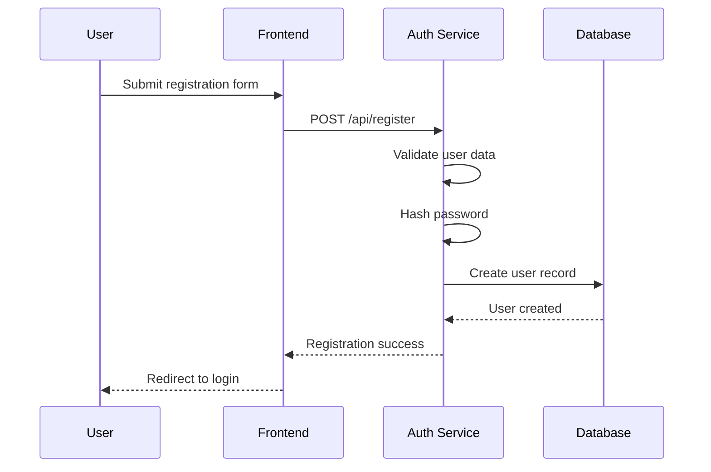
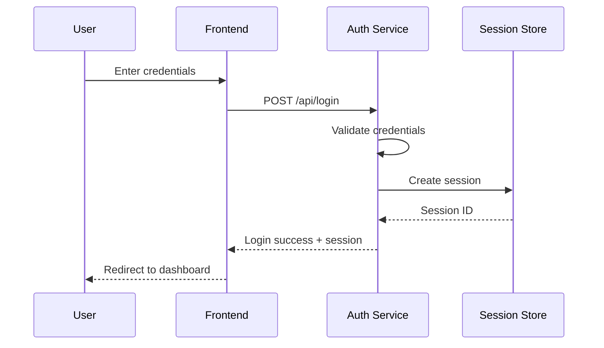
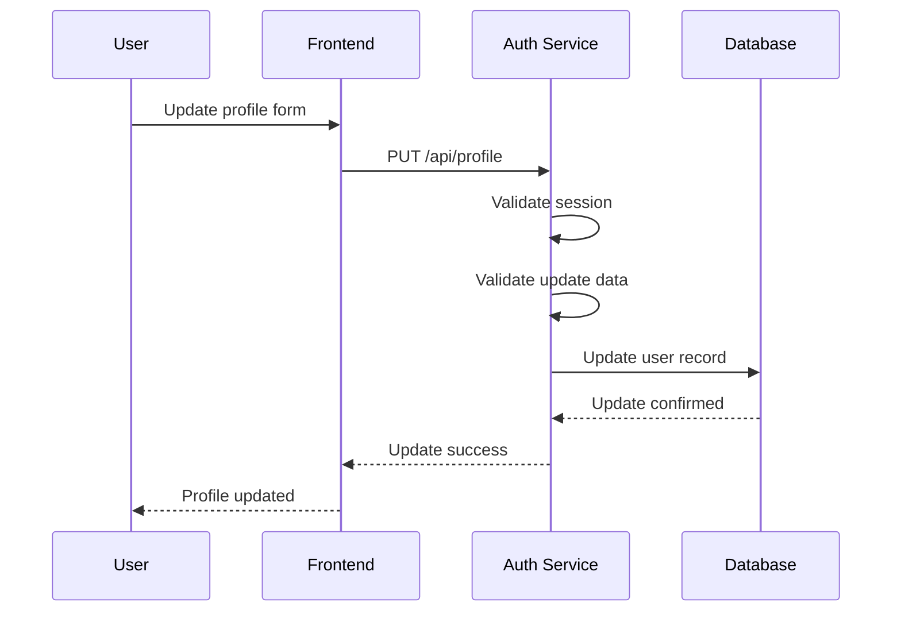

# User Management Functional Area

## 1. Overview

### 1.1 Purpose
The User Management system provides secure authentication, authorization, and profile management capabilities for the ATMosFera platform. It implements role-based access control (RBAC) and session management to ensure secure access to platform resources.

### 1.2 Scope
- User registration and authentication
- Role-based access control
- Profile management and preferences
- Session management and security
- Password policies and security

### 1.3 Key Components
- Authentication service
- Authorization middleware
- User profile management
- Session store and management
- Security policies and enforcement

## 2. Key Features

### 2.1 Authentication
- **Local Authentication**: Username/password with secure hashing (bcrypt)
- **Session Management**: Secure session tokens with configurable expiration
- **Password Security**: Complex password requirements and hashing
- **Account Security**: Failed login attempt tracking and lockout protection

### 2.2 Authorization
- **Role-Based Access Control**: Three primary user roles
- **Project-Level Permissions**: Access control at project level
- **Resource Protection**: Secured API endpoints and UI components
- **Middleware Integration**: Express.js middleware for route protection

### 2.3 User Roles
1. **Admin**: System administration and global configuration
2. **Manager**: Project management and team oversight
3. **User**: Standard platform access and test management

### 2.4 Profile Management
- **User Profiles**: Comprehensive user information management
- **Preferences**: Customizable user preferences and settings
- **Profile Updates**: Self-service profile modification
- **Data Privacy**: GDPR-compliant data handling

## 3. User Workflows

### 3.1 User Registration


### 3.2 User Login


### 3.3 Profile Update


## 4. Technical Architecture

### 4.1 Authentication Flow
```typescript
// Authentication middleware
export function requireAuth(req: Request, res: Response, next: NextFunction) {
  if (!req.isAuthenticated()) {
    return res.status(401).json({ message: "Not authenticated" });
  }
  next();
}

// Role-based authorization
export function requireRole(role: string) {
  return (req: Request, res: Response, next: NextFunction) => {
    if (!req.user || req.user.role !== role) {
      return res.status(403).json({ message: "Insufficient permissions" });
    }
    next();
  };
}
```

### 4.2 Password Security
```typescript
// Password hashing
async function hashPassword(password: string): Promise<string> {
  const saltRounds = 12;
  return bcrypt.hash(password, saltRounds);
}

// Password comparison
async function comparePasswords(supplied: string, stored: string): Promise<boolean> {
  return bcrypt.compare(supplied, stored);
}
```

### 4.3 Session Configuration
```typescript
// Session configuration
app.use(session({
  secret: process.env.SESSION_SECRET,
  resave: false,
  saveUninitialized: false,
  store: new MemoryStore(),
  cookie: {
    secure: process.env.NODE_ENV === 'production',
    httpOnly: true,
    maxAge: 24 * 60 * 60 * 1000 // 24 hours
  }
}));
```

## 5. API Endpoints

### 5.1 Authentication Endpoints

#### POST /api/register
**Purpose**: Register a new user account
**Request Body**:
```json
{
  "username": "string",
  "password": "string",
  "fullName": "string",
  "email": "string",
  "role": "user|manager|admin"
}
```
**Response**: User object (without password)

#### POST /api/login
**Purpose**: Authenticate user and create session
**Request Body**:
```json
{
  "username": "string",
  "password": "string"
}
```
**Response**: User object and session establishment

#### POST /api/logout
**Purpose**: Terminate user session
**Authentication**: Required
**Response**: Logout confirmation

### 5.2 User Management Endpoints

#### GET /api/user
**Purpose**: Get current user information
**Authentication**: Required
**Response**: Current user object

#### PUT /api/user/profile
**Purpose**: Update user profile
**Authentication**: Required
**Request Body**:
```json
{
  "fullName": "string",
  "email": "string"
}
```
**Response**: Updated user object

#### PUT /api/user/password
**Purpose**: Change user password
**Authentication**: Required
**Request Body**:
```json
{
  "currentPassword": "string",
  "newPassword": "string"
}
```
**Response**: Success confirmation

### 5.3 Admin Endpoints

#### GET /api/admin/users
**Purpose**: List all users (admin only)
**Authentication**: Required (admin role)
**Response**: Array of user objects

#### PUT /api/admin/users/:id/role
**Purpose**: Update user role (admin only)
**Authentication**: Required (admin role)
**Request Body**:
```json
{
  "role": "user|manager|admin"
}
```
**Response**: Updated user object

## 6. Database Schema

### 6.1 Users Table
```sql
CREATE TABLE users (
  id SERIAL PRIMARY KEY,
  username VARCHAR(50) UNIQUE NOT NULL,
  password_hash VARCHAR(255) NOT NULL,
  full_name VARCHAR(100) NOT NULL,
  email VARCHAR(255) UNIQUE NOT NULL,
  role VARCHAR(20) DEFAULT 'user' NOT NULL,
  is_active BOOLEAN DEFAULT true,
  last_login TIMESTAMP,
  failed_login_attempts INTEGER DEFAULT 0,
  locked_until TIMESTAMP,
  created_at TIMESTAMP DEFAULT CURRENT_TIMESTAMP,
  updated_at TIMESTAMP DEFAULT CURRENT_TIMESTAMP
);
```

### 6.2 User Sessions Table
```sql
CREATE TABLE user_sessions (
  session_id VARCHAR(128) PRIMARY KEY,
  user_id INTEGER REFERENCES users(id) ON DELETE CASCADE,
  expires TIMESTAMP NOT NULL,
  data JSONB,
  created_at TIMESTAMP DEFAULT CURRENT_TIMESTAMP
);
```

### 6.3 User Preferences Table
```sql
CREATE TABLE user_preferences (
  id SERIAL PRIMARY KEY,
  user_id INTEGER REFERENCES users(id) ON DELETE CASCADE,
  preference_key VARCHAR(100) NOT NULL,
  preference_value JSONB,
  created_at TIMESTAMP DEFAULT CURRENT_TIMESTAMP,
  updated_at TIMESTAMP DEFAULT CURRENT_TIMESTAMP,
  UNIQUE(user_id, preference_key)
);
```

## 7. Configuration

### 7.1 Environment Variables
```bash
# Session configuration
SESSION_SECRET=your-secret-key-here
SESSION_TIMEOUT_HOURS=24

# Password policy
PASSWORD_MIN_LENGTH=8
PASSWORD_REQUIRE_UPPERCASE=true
PASSWORD_REQUIRE_LOWERCASE=true
PASSWORD_REQUIRE_NUMBERS=true
PASSWORD_REQUIRE_SYMBOLS=true

# Account security
MAX_FAILED_ATTEMPTS=5
LOCKOUT_DURATION_MINUTES=30
```

### 7.2 Password Policy Configuration
```typescript
interface PasswordPolicy {
  minLength: number;
  requireUppercase: boolean;
  requireLowercase: boolean;
  requireNumbers: boolean;
  requireSymbols: boolean;
  preventReuse: number; // Last N passwords
}

const defaultPasswordPolicy: PasswordPolicy = {
  minLength: 8,
  requireUppercase: true,
  requireLowercase: true,
  requireNumbers: true,
  requireSymbols: false,
  preventReuse: 5
};
```

## 8. Security Considerations

### 8.1 Password Security
- **Hashing Algorithm**: bcrypt with 12 salt rounds
- **Password Complexity**: Configurable requirements
- **Password History**: Prevention of password reuse
- **Secure Storage**: No plaintext password storage

### 8.2 Session Security
- **Secure Cookies**: HTTPOnly and Secure flags
- **Session Expiration**: Configurable timeout
- **Session Regeneration**: New session ID on login
- **CSRF Protection**: Token-based protection

### 8.3 Account Protection
- **Failed Attempt Tracking**: Monitor and limit login attempts
- **Account Lockout**: Temporary lockout after failed attempts
- **Brute Force Protection**: Rate limiting and IP blocking
- **Audit Logging**: Comprehensive security event logging

### 8.4 Data Protection
- **GDPR Compliance**: Right to deletion and data portability
- **PII Encryption**: Sensitive data encryption at rest
- **Data Minimization**: Collect only necessary information
- **Access Logging**: Track all data access and modifications

## 9. Performance Metrics

### 9.1 Authentication Metrics
- **Login Success Rate**: Successful login percentage
- **Authentication Response Time**: Average login processing time
- **Session Creation Rate**: New sessions per minute
- **Failed Login Rate**: Failed authentication attempts

### 9.2 User Activity Metrics
- **Active Users**: Daily/Monthly active user counts
- **Session Duration**: Average session length
- **Profile Updates**: Profile modification frequency
- **Role Distribution**: User role distribution statistics

### 9.3 Security Metrics
- **Failed Login Attempts**: Failed authentication tracking
- **Account Lockouts**: Account security incidents
- **Password Changes**: Password update frequency
- **Security Incidents**: Authentication-related security events

## 10. Troubleshooting

### 10.1 Common Issues

#### Authentication Failures
**Symptom**: Users cannot log in with correct credentials
**Causes**: 
- Session store issues
- Password hash corruption
- Account lockout
**Resolution**:
1. Check session store connectivity
2. Verify password hash in database
3. Reset account lockout status
4. Review audit logs for patterns

#### Session Issues
**Symptom**: Users logged out unexpectedly
**Causes**:
- Session timeout
- Session store failure
- Cookie configuration issues
**Resolution**:
1. Verify session timeout configuration
2. Check session store health
3. Review cookie settings
4. Validate session middleware configuration

#### Permission Errors
**Symptom**: Users cannot access authorized resources
**Causes**:
- Role misconfiguration
- Authorization middleware issues
- Database role corruption
**Resolution**:
1. Verify user role in database
2. Check authorization middleware
3. Review route protection
4. Validate role-based access control

### 10.2 Monitoring and Alerting
- **Failed Login Monitoring**: Alert on high failure rates
- **Account Lockout Alerts**: Notify on security incidents
- **Session Store Monitoring**: Track session store health
- **Performance Monitoring**: Monitor authentication response times

### 10.3 Recovery Procedures
- **Password Reset**: Admin-initiated password reset process
- **Account Unlock**: Manual account lockout removal
- **Session Recovery**: Session store backup and restoration
- **Role Recovery**: User role correction procedures

---

**Document Version:** 1.0  
**Last Updated:** July 16, 2025  
**Next Review:** August 16, 2025  
**Owner:** Authentication Team